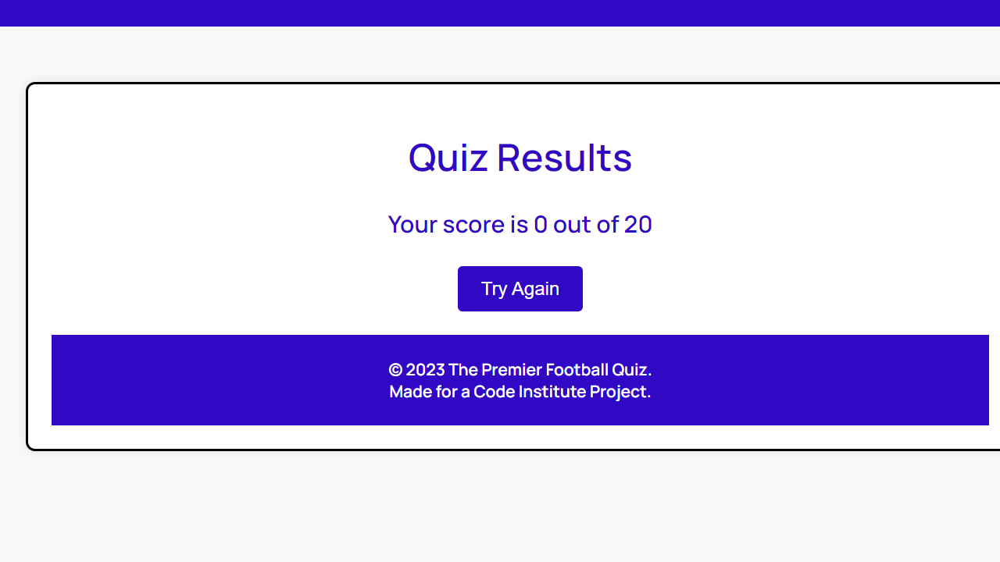

# The Premier Quiz!

Welcome! The Premier Football Quiz is a simple and clean designed website that will put your knowledge to the test -- Whether youre a beginner with little football knowledge or a total footbal enthusiast.

## Features

### 1. The Heading

+ As seen on the home page, the Heading is a minimalistic designed header so as to grab the attention of the user and to clearly tell the user what the website is about.

### 2. Introductory Section

+ This section clearly indicates to the user what The Premier Football Quiz is all about. It explains to the user what type of quiz it is, what to expect from the quiz and excites the user about the quiz..

### 3. Question Section

+ This section contains 1 div that holds all the randomly generated questions.
+ Each section question has between 3-4 optons all tagged with a radio button that allows the user to select the answer they think is correct.
+ Each question is colored in blue so as to go along with the theme of the page.
+ The submit button will enter the users answer and the next random question will automatically load.

### 4. Timer

+ The Timer starts at 2.00 and starts ticking down as soon as the page is loaded.
+ The Timer also gives the user a bit of urgency to get the quiz completed within the time as they do not know how many questions there are until the quiz is completed.

### 5. Results Section

+ The Results Section is a simple designed page with shows the users their result.
+ It also has a Try Again button which will allow the user to retake the quiz.
+ After clicking the Try Again button, the Timer will restart at 2.00.

### 6. Footer

+ The Footer fits in with the color scheme of the website.
+ It shows the name of the website and the reason behind why the quiz was made.

## Validator Testing

### 1. HTML

Throughout the course of building this website, I periodically tested the website.
As far as I am aware, the website works as intended on all devices.

There were no errors returned when passing through the official W3C validator.

### 2. CSS

I also periodically tested the CSS on each page and features to see if the CSS syling rules worked on all devices.
As far as I am aware, all pages and features work and appear correctly on each seperate device.

There were no errors found when passing through the official Jigsaw Validator.

### 3. JavaScript

During my testing of the JS used in the site, the results show -

There are 14 functions in this file.

Function with the largest signature take 2 arguments, while the median is 0.

Largest function has 7 statements in it, while the median is 4.

The most complex function has a cyclomatic complexity value of 3 while the median is 1.

It also shows that there are 32 warnings but 0 errors.

### Lighthouse(Desktop)

Using Lighouse to inspect the website on Desktop and the results are as follows -

### Lighthouse(Mobile)

Using lighthouse to inspect the website on Mobile and the results are as follows -

## Bugs

I found one bug in my code that stops the website from working 100% as intended. The quiz should automatically submit once the timer runs to 0, but afer many attempts at fixing the bug I could not get it to work correctly.

## Deployment 

The site was deployed to Github pages. The steps I took to deploy were as follows:

+ In my GitHub repository, navigate to Settings.
+ In code and automation section, click on the Pages button
+ In the GitHub Pages section, select Main Branch and root folder and click save.
+ From there the page will automatically refresh and a live link will appear.

The live link can be found here - [The Premier Football Quiz](https://dr0per.github.io/The-Premier-Quiz/).

## Credits 

+ The text for the Introductory Section was created using ChatGPT.
+ I relied heavily on the information that I learned throughout the Java Script Essentials modules with Code Institute.
+ I also learned alot from Coding Ninjas and Stack Overflow throughout this project.
+ I completed this project without the use of any Third Party Code so in my opinion that is the reason this website is basic but gets the job done.